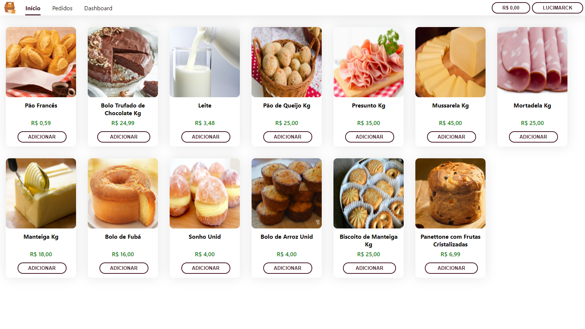

# Comercio Eletronico

Aplicação WEB desenvolvida: Comércio Eletrônico 

## Ambiente

O projeto foi dividido em duas aplicações:

- Backend C# ASP.NET Core
- Frontend Typescript Next.js

E o banco de dados: SQLite. Contando com recursos como Json Web Tokens (JWT), OpenAPI, Swagger, SASS e entre outros.